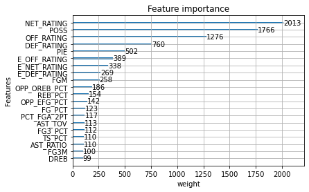

Superteam is a basketball analytics framework for identifying strong competitive teams from individual player performances of players on the teams roster. By collecting large amounts of detailed player performance data over more than 30000 NBA games, a regression model is trained to predict the overall team performance of a specific game from the corresponding collective player performances. Another regression model is then trained to map a teams overall performance relative to its opponents team performance to the teams plus minus score which indicates whether the team won the game or not and by how many points it won or lost.

While the latter of the two models can predict whether a team won or lost with more than 99% accuracy, the former model tasked with mapping individual performance to team performance is the clear bottleneck limiting overall predictive power of the combined pipeline. By combining the two models we then have a mapping from 2 groups of individual player performances to a plus minus score indicating who of the two groups of players won the game. In order to get these individual player performances, we then average over all past performances for a specific player.

As the outcomes of this pipeline are relative with respect to an opposing team, an elimination tournament is set up similar to the NBA playoff in which the winner has to go unbeaten throughout all round (instead of playing a best of 7 series a single simulated match will be used to determine the winner). By randomly selecting players from a player pool and calculating their average performance statistics over a fixed period of time, teams are created and matched up against each other. The winner of the tournament is then identified and kept constant in the following tournament. By looping over multiple tournaments, eventually a team emerges which remains unbeated against various randomly selected teams. Moreover, individual teams are matched up against a large number of randomly selected teams and win loss outcomes statistics can be calculated in a way similar to the regular NBA season.

As of now, we require a fixed amount of players for each team per game which we have set to the official NBA limit of 13 players. A model, requiring only the starting 5 players is also provided. Moreover we currently have no clear way of identifying why a team is better than another team other than by explicity looking a feature importances of the model determining which team won and looking at the predicted overall team performances it takes as input. 

To get started, simply run a tournament and view the outcome.